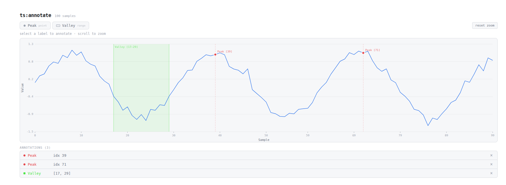

# ts-annotator

Interactive time series annotation widget for **Marimo** and **Streamlit**.



Click to place point labels, drag to select ranges. Zoom with scroll wheel. Built with [anywidget](https://anywidget.dev/) — zero dependencies beyond `traitlets`.

## Installation

```bash
uv add ts-annotator
```

For Streamlit support:

```bash
uv add ts-annotator[streamlit]
```

## Usage — Marimo

```python
import marimo as mo
import numpy as np
from ts_annotator import TimeSeriesAnnotator, LabelConfig

data = np.cumsum(np.random.randn(1000)).tolist()

labels = [
    LabelConfig(name="Peak",         color="#E5484D", type="point"),
    LabelConfig(name="Artifact",     color="#E5960B", type="range"),
    LabelConfig(name="Steady State", color="#7C5CFC", type="range"),
]

widget = mo.ui.anywidget(TimeSeriesAnnotator(
    data=data,
    labels=labels,
    sample_rate=100,       # x-axis in seconds
    x_label="Time (s)",
    y_label="EMG (mV)",
))
```

```python
# Cell 1: display the widget
widget
```

```python
# Cell 2: reactive readout — re-runs when annotations change
widget.annotations
```

### Output format

`widget.annotations` returns a list mirroring your label configs, with `value` filled in:

```python
[
    {"name": "Peak",         "color": "#E5484D", "type": "point", "value": [342]},
    {"name": "Artifact",     "color": "#E5960B", "type": "range", "value": [[120, 180]]},
    {"name": "Steady State", "color": "#7C5CFC", "type": "range", "value": None},
]
```

- **point**: `list[int]` (always a list)
- **range**: `list[tuple[start, end]]` (always a list of tuples in Python)
- **None**: no annotation placed yet

## Usage — Streamlit

```python
import streamlit as st
from ts_annotator.streamlit import streamlit_annotator
from ts_annotator import LabelConfig

streamlit_annotator(
    data=my_data,
    labels=[LabelConfig("Peak", "#E5484D", "point")],
)
```

```python
annotations = streamlit_annotator(
    data=my_data,
    labels=[LabelConfig("Peak", "#E5484D", "point")],
    key="main-annotator",  # recommended for stable Streamlit state
)

st.write(annotations)
```

The Streamlit integration is bidirectional: annotation edits are sent back
to Python and returned by `streamlit_annotator(...)`.

## Controls

| Action | Effect |
|---|---|
| Click a label button | Activate that annotation mode |
| Click on chart | Place point annotation (point mode) |
| Click + drag | Select range annotation (range mode) |
| Scroll wheel | Zoom in/out at cursor |
| Esc | Deselect active label |
| × button | Remove individual annotation |

## LabelConfig

```python
@dataclass
class LabelConfig:
    name: str                          # display name
    color: str                         # CSS color
    type: Literal["point", "range"]    # click vs drag
    value: ... | None = None           # filled by widget
```

## Development

```bash
git clone https://github.com/simon/ts-annotator
cd ts-annotator
pip install -e ".[dev]"
pytest
```

## License

MIT
